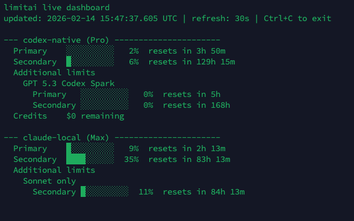
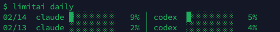

[English](README.md) | [한국어](README.ko.md) | [日本語](README.ja.md) | [Español](README.es.md) | [Português](README.pt.md) | [Français](README.fr.md)

# limitai

> 跨 Claude、Codex 和 CLIProxyAPI 监控 LLM 速率限制利用率的 CLI 工具

**你真的充分利用了 LLM 订阅额度吗？**

[ccusage](https://github.com/yohasebe/ccusage) 等工具可以追踪你消耗了多少 token，但这并不是关键问题。真正重要的是：**你实际使用了多少你正在付费的配额？** 如果你同时在 Claude、Codex 或代理服务上使用多个账户，那就没有一个统一的地方可以一目了然地看到全部情况。

**limitai** 是面向 LLM 重度用户的 **CLI 速率限制监控工具**。它在一个终端视图中显示你在每个账户和提供商上的**速率限制利用率**——不是你花了多少钱，而是你离正在付费的上限有多近，以及上限何时重置。

- **多提供商仪表盘** — Claude (Anthropic)、Codex (OpenAI)、CLIProxyAPI 一目了然
- **多账户支持** — 个人、团队、代理账户同时查看
- **利用率优先** — 追踪速率限制的使用百分比，而非原始 token 数量
- **零配置** — 自动发现本机上的凭证
- **后台记录** — `limitai install` 一键设置 LaunchAgent/systemd 守护进程，进行历史追踪

<table align="center">
  <tr>
    <td colspan="2" align="center">
      <code>limitai status</code><br><br>
      
    </td>
  </tr>
  <tr>
    <td align="center">
      <code>limitai daily</code><br><br>
      
    </td>
    <td align="center">
      <code>limitai monthly</code><br><br>
      
    </td>
  </tr>
</table>

## 安装

```bash
curl -fsSL https://raw.githubusercontent.com/worktoolai/limitai/main/install.sh | bash
```

安装到 `~/.local/bin`，并自动更新 shell PATH。

### 选项

```bash
# Specific version
curl -fsSL https://raw.githubusercontent.com/worktoolai/limitai/main/install.sh | bash -s -- --version v0.1.0

# Custom directory
curl -fsSL https://raw.githubusercontent.com/worktoolai/limitai/main/install.sh | bash -s -- --dir /usr/local/bin
```

### 卸载

```bash
curl -fsSL https://raw.githubusercontent.com/worktoolai/limitai/main/install.sh | bash -s -- --uninstall
```

删除二进制文件，并清理 shell profile 中的 PATH 条目。

### 支持的平台

| 平台 | 架构 |
|----------|-------------|
| macOS | Apple Silicon (arm64) |
| macOS | Intel (x64) |
| Linux | x64 |
| Linux | arm64 |

## 快速开始

```bash
# See your rate limits right now
limitai status

# Discover all accounts on this machine
limitai list
```

## 启用历史追踪

默认情况下，limitai 只显示**实时**快照。运行一次 `install` 即可解锁全部功能：

```bash
limitai install
# ✔ LaunchAgent registered (macOS) — polling every 5 min
# ✔ SQLite database created at ~/.limitai/data.db
# ✔ Adaptive polling active — speeds up near resets
#
# Done. limitai is now recording in the background.
# Run `limitai daily` anytime to see your history.
```

### `install` 之后的变化

```
                    Before                              After
              ┌──────────────────┐             ┌──────────────────────────┐
              │                  │             │                          │
              │  limitai status  │             │  limitai status          │
              │  (live only)     │             │  limitai daily    ← NEW  │
              │                  │             │  limitai monthly  ← NEW  │
              │                  │             │                          │
              └──────────────────┘             └──────────────────────────┘
                  Manual run                      Automatic background
                  Point-in-time                   Continuous recording
```

> **一条命令。无需 cron。无需配置文件。** 只需 `limitai install`，然后就可以忘掉它了。

### 你将获得

| 收益 | 详细说明 |
|---------|--------|
| **Daily utilization report** | 查看每个账户在各时间窗口中的使用强度 |
| **Monthly trends** | 发现规律——例如每周二是否持续达到 90%+ |
| **Peak tracking** | 追踪每个窗口的最高使用量，而非仅仅是平均值 |
| **Adaptive polling** | 在重置时间附近每 1 分钟轮询，其余时间 5–10 分钟——捕捉关键时刻 |
| **Survives reboots** | 使用操作系统原生调度器（LaunchAgent / systemd），而非脆弱的后台进程 |
| **30-day rolling history** | 原始快照保留 30 天，每日汇总永久保留 |
| **Zero maintenance** | 无需日志轮转，无需担心磁盘膨胀。SQLite 全部搞定 |

### 内部工作原理

```
┌──────────────┐     poll      ┌───────────────┐    store     ┌──────────────┐
│  Codex API   │◄─────────────►│               │─────────────►│              │
│  Claude CLI  │   every 1-10  │   limitai     │              │   SQLite     │
│  CLIProxyAPI │   min (smart) │   background  │              │   ~/.limitai │
└──────────────┘               │   daemon      │              │   /data.db   │
                               └───────────────┘              └──────┬───────┘
                                                                     │
                                                        ┌────────────┼────────────┐
                                                        │            │            │
                                                        ▼            ▼            ▼
                                                   limitai      limitai      limitai
                                                    status       daily       monthly
```

### 随时卸载

```bash
limitai uninstall
# ✔ LaunchAgent removed. No data deleted.
# To also remove history: rm -rf ~/.limitai
```

## 全部命令

```bash
limitai status          # Live rate limit dashboard (auto-refreshes)
limitai list            # Show all discovered accounts
limitai daily           # Daily utilization history
limitai monthly         # Monthly utilization history
limitai install         # Start background recording daemon
limitai uninstall       # Remove daemon
limitai doctor          # Diagnose connection issues
limitai watch           # Run foreground polling loop
```

## 许可证

MIT
